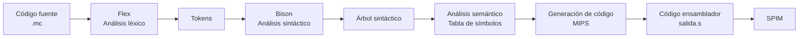

# MiniC


**Autoría:**
- [Ibrahim Cherif Barry](https://github.com/ibracb)
- [David Madrid del Amor](https://github.com/David220604)

**Grado en Ingeniería Informática · Universidad de Murcia**

**Curso 2024/2025**

---

## Descripción

**MiniC** es un compilador para un subconjunto simplificado del lenguaje C. Dado un programa fuente `.mc`, lo traduce a código ensamblador **MIPS**, que puede ejecutarse con el emulador **SPIM**.

El compilador está construido con las herramientas clásicas del proceso de compilación:

- **Flex** — analizador léxico: divide el código fuente en tokens (palabras clave, operadores, identificadores, etc.).
- **Bison** — analizador sintáctico y semántico: verifica que la secuencia de tokens se ajusta a la gramática y realiza las comprobaciones semánticas.
- **C** — generación de código MIPS.

---

## Características

- Declaración de **variables** (`var`) y **constantes** (`const`) de tipo `int`.
- Asignaciones y expresiones aritméticas (`+`, `-`, `*`, `/`), incluyendo el operador unario de negación.
- **Operador ternario**: `(condicion ? valor1 : valor2)`.
- Estructuras de control: `if` / `if-else` y `while`.
- Entrada/salida: `print` (enteros y cadenas) y `read` (enteros).
- Manejo de **cadenas de texto** con caracteres de escape (`\"`, `\n`, `\t`, `\r`).
- Comentarios de línea (`//`) y multilínea (`/* ... */`).
- Reporte de errores **léxicos**, **sintácticos** y **semánticos** con recuperación en modo pánico.
- Generación de código ensamblador MIPS con gestión de registros temporales y etiquetas.

---

## Pipeline de compilación

El compilador sigue las fases clásicas de la compilación:



1. **Análisis léxico (Flex):** identifica los tokens y gestiona errores léxicos.
2. **Análisis sintáctico (Bison):** reconoce la estructura del programa según la gramática.
3. **Análisis semántico:** usa una **tabla de símbolos** para verificar la correcta declaración y uso de variables, constantes y cadenas.
4. **Generación de código:** traduce el programa a instrucciones MIPS.

---

## Gramática

```
program → id ( ) { declarations statement_list }

declarations → declarations var tipo var_list ;
             | declarations const tipo const_list ;
             | λ

tipo → int

var_list → id
         | var_list , id

const_list → id = expression
           | const_list , id = expression

statement_list → statement_list statement
                | λ

statement → id = expression ;
          | { statement_list }
          | if ( expression ) statement else statement
          | if ( expression ) statement
          | while ( expression ) statement
          | print ( print_list ) ;
          | read ( read_list ) ;

print_list → print_item
           | print_list , print_item

print_item → expression
           | string

read_list → id
          | read_list , id

expression → expression + expression
           | expression - expression
           | expression * expression
           | expression / expression
           | ( expression ? expression : expression )
           | - expression
           | ( expression )
           | id
           | num
```

La precedencia y asociatividad de los operadores se define en Bison: `+`/`-` asociativos por la izquierda, `*`/`/` asociativos por la izquierda con mayor precedencia, y el operador ternario y las condicionales asociativos por la derecha. Se usa `%expect 1` para aceptar el conflicto desplazamiento/reducción típico del `if` anidado con `else`.

---

## Estructura del repositorio

| Fichero | Descripción |
|---------|-------------|
| `proyecto/lexico1.l` | Analizador léxico (Flex). |
| `proyecto/miniC.y` | Gramática, análisis sintáctico y semántico, y generación de código (Bison). |
| `proyecto/main.c` | Punto de entrada del ejecutable. |
| `proyecto/listaSimbolos.h` / `.c` | Tabla de símbolos. |
| `proyecto/listaCodigo.h` / `.c` | Gestión de listas de instrucciones. *(Ver requisitos.)* |
| `proyecto/Makefile` | Compilación y ejecución. |
| `proyecto/entrada.mc` | Programa de ejemplo. |

---

## Requisitos

Para compilar y ejecutar el proyecto necesitas:

- **Flex**
- **Bison**
- **gcc**
- **SPIM** (para ejecutar el ensamblador generado)

> **Importante:** la compilación depende de los ficheros `listaCodigo.h` y `listaCodigo.c`, que no se incluyen en este repositorio porque no se han modificado. Debes añadirlos a `proyecto/` antes de compilar.

---

## Compilación y uso

Clona el repositorio y accede al directorio del proyecto:

```bash
cd proyecto
```

**Compilar y ejecutar el programa de ejemplo:**

```bash
make run
```

Esto genera el ejecutable `ejecutable_minic` y traduce `entrada.mc` al fichero `salida.s` con el código ensamblador.

**Compilar únicamente:**

```bash
make
```

**Traducir un fichero fuente arbitrario:**

```bash
./ejecutable_minic fichero_entrada > fichero_salida.s
```

**Ejecutar el ensamblador generado con SPIM:**

```bash
spim -file fichero_salida.s
```

**Limpiar los ficheros generados:**

```bash
make clean
```

---

## Ejemplo

Programa de entrada (`entrada.mc`):

```c
prueba() {
  const int cero = 0, uno = 1;
  var int x, y, contador;

  print ("--- INICIO DEL PROGRAMA ---\n");
  x = 10;
  y = (x ? 5 : 4);
  contador = x + y - 3;

  print ("Cuenta regresiva:\n");
  while (contador) {
    print ("contador =", contador, "\n");
    contador = contador - 1;
  }

  print ("Introduce un valor para x:\n");
  read(x);
  print ("Valor leído: ", x, "\n");
  print ("--- FIN DEL PROGRAMA ---\n");
}
```

Código MIPS generado (`salida.s`):

```asm
##################
# Seccion de datos
.data
_cero:
    .word 0
_uno:
    .word 0
_x:
    .word 0
_y:
    .word 0
_contador:
    .word 0
$str0:
    .asciiz "--- INICIO DEL PROGRAMA ---\n"
$str1:
    .asciiz "Cuenta regresiva:\n"
$str2:
    .asciiz "contador ="
$str3:
    .asciiz "\n"
$str4:
    .asciiz "Introduce un valor para x:\n"
$str5:
    .asciiz "Valor leído: "
$str6:
    .asciiz "\n"
$str7:
    .asciiz "--- FIN DEL PROGRAMA ---\n"
.text
.globl main
main:
li $t0,1
sw $t0,_uno
lw $t0,_x
lw $t1,_y
lw $t2,_contador
li $v0,4
la $a0,$str0
syscall
li $t3,10
sw $t3,_x
lw $t3,_x
beqz $t3,etiq1
li $t4,5
move $t6,$t4
b etiq2
etiq1:
li $t5,4
move $t6,$t5
etiq2:
sw $t6,_y
lw $t3,_x
lw $t4,_y
add $t3,$t3,$t4
li $t4,3
sub $t3,$t3,$t4
sw $t3,_contador
li $v0,4
la $a0,$str1
syscall
etiq4:
lw $t3,_contador
beqz $t3,etiq3
li $v0,4
la $a0,$str2
syscall
lw $t4,_contador
li $v0,1
move $a0,$t4
syscall
li $v0,4
la $a0,$str3
syscall
lw $t5,_contador
li $t6,1
sub $t5,$t5,$t6
sw $t5,_contador
b etiq4
etiq3:
li $v0,4
la $a0,$str4
syscall
li $v0,5
syscall
sw $v0,_x
li $v0,4
la $a0,$str5
syscall
lw $t5,_x
li $v0,1
move $a0,$t5
syscall
li $v0,4
la $a0,$str6
syscall
li $v0,4
la $a0,$str7
syscall
li $v0, 10
syscall
```

Salida en ejecución (con SPIM):

```
--- INICIO DEL PROGRAMA ---
Cuenta regresiva:
contador =12
contador =11
contador =10
contador =9
contador =8
contador =7
contador =6
contador =5
contador =4
contador =3
contador =2
contador =1
Introduce un valor para x:
6
Valor leído: 6
--- FIN DEL PROGRAMA ---
```

---

## Gestión de errores

El compilador mantiene tres contadores de errores independientes:

- **Errores léxicos:** símbolos no reconocidos, identificadores demasiado largos y enteros fuera de rango.
- **Errores sintácticos:** secuencias de tokens que no se ajustan a la gramática.
- **Errores semánticos:** variables no declaradas, reasignación de constantes, constantes duplicadas, etc.

Al final del análisis se muestran los totales de cada tipo. Solo si no hay errores se genera el código MIPS; en caso contrario, la compilación se aborta sin generar ensamblador.
